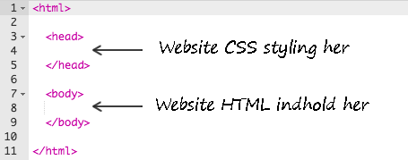
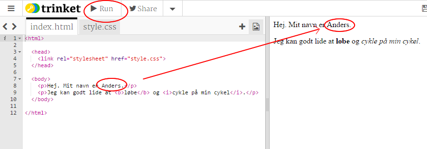
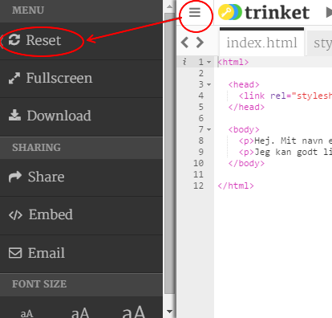
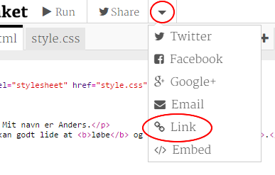
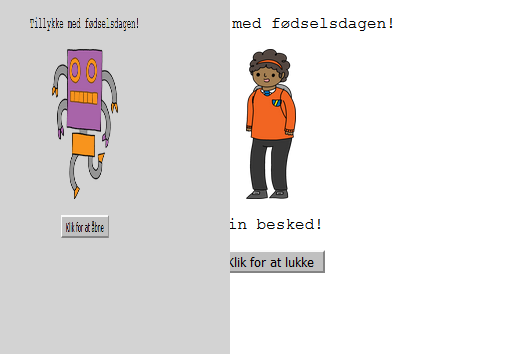

---
title: Tillykke Med Fødselsdagen
level: HTML & CSS 1
language: da-DK
embeds: "*.png"
materials: ["Klubleder Ressourcer/*.*","Projekt Ressourcer/*.*"]
stylesheet: web
...

# Introduktion { .intro}

I dette projekt bliver du introduceret til HTML & CSS ved at lære, hvordan du laver dit helt eget personlige fødselsdagskort.


# Trin 1: Hvad er HTML? { .activity}

HTML står for __HyperText Markup Language__, hvilket er det sprog, som man bruger til at lave websider. Lad os tage et kig på et eksempel!

## Arbejdsliste { .check}

+ Du skal bruge en webside, der hedder Trinket til at skrive din HTML. Åbn denne Trinket: <a href="https://trinket.io/html/efe71ccab3" target="_blank">jumpto.cc/web-intro</a>. Hvis du læser dette online, så kan du også benytte den indlejrede Trinket nedenfor.

<div class="trinket">
	<iframe src="https://trinket.io/embed/html/efe71ccab3" width="100%" height="400" frameborder="0" marginwidth="0" marginheight="0" allowfullscreen></iframe> 
</div> 

+ Koden, som vises til venstre i vores Trinket, er HTML. I højre side kan du se den webside, som HTML koden har lavet. 

HTML bruger __tags__ til at opbygge websider. Prøv at lægge mærke til følgende HTML i linje 8 af din kode:

``` 
	<p>Hej. Mit navn er Anders.</p>
``` 

`<p>` er et eksempel på et tag, og er en forkortelse af __paragraph__. Du kan begynde en paragraf med `<p>` og afslutte en paragraf med `</p>`.

+ Kan du få øje på andre tags? Måske du har lagt mærke til et tag på linje 9, som er `<b>`, hvilket står for __bold__ (fed):

``` 
	<b>løbe</b>
``` 

Her er nogle flere tags:

	+ `<html>` og `</html>` markerer begyndelsen og slutningen af dit HTML dokument;
	+ `<head>` og `</head>` omringer fx din CSS (det kommer vi ind på senere!);
	+ `<body>` og `</body>` indeholder dit website indhold. 

	

+ Prøv at ændre en af dine tekstparagrafer i din HTML (til venstre). Klik på 'Run'. Nu bør du se, at din webside ændrer sig (i højre side)! 

	  

+ Hvis du har lavet en fejl og har lyst til at fortryde dine ændringer, så kan du klikke på menuknappen og derefter 'Reset'. Prøv det selv! 

	  

## Gem dit projekt {.save}

__Du behøver ikke have en Trinket konto for at kunne gemme dine projekter!__  

Hvis du ikke har en Trinket konto, så klik på pil-ikonet, der vender nedad, og klik så på 'Link'. Så vil du få et link, som du kan gemme og vende tilbage til senere. Dette skal du gøre hver gang du laver ændringer, som du gerne vil gemme, for linket ændrer sig tilsvarende! 

  

Hvis du har en Trinket konto, så er den letteste måde at gemme din webside på ved at klikke på 'Remix' knappen øverst til højre. Så gemmer du en kopi af din Trinket på din profil. 

  

##Udfordring: Tilføj en ny paragraf {.challenge}
Kan du tilføje en tredje tekstparagraf til din webside under dine 2 øvrige paragrafer? Husk at din nye paragraf skal starte med et `<p>` tag og slutte med et `</p>`.
 
Din webside bør se således ud: 

  

Kan du tilføje __fed__ (bold) og <u>understreget</u> tekst til din nye paragraf? Du skal bruge `<u>` og `</u>` for at understrege din tekst.  

## Gem dit projekt {.save}

# Trin 2: Hvad er CSS? { .activity}

CSS står for __Cascading Style Sheets__, og er det sprog man bruger til at style websider (forme layout) og få dem til at se indbydende ud. Du kan linke din webside til en CSS fil i `<head>` sektionen af et HTML dokument på denne måde: 


## Arbejdsliste { .check}

+ CSS definerer __egenskaberne__ for et givent tag. Klik på 'style.css' fanen for at CSS'en til din webside.  
 
	

+ Find denne kode:

``` 
	p {
		color: black;
	}
``` 

Denne CSS kode indeholder en enkelt egenskab for paragrafer, hvilket er at tekstfarven skal være sort. 

+ Ændr ordet 'black' i CSS'en til 'blue'. Du bør nu se at tekstfarven på alle dine paragrafer skifter farve til blå. 

	

## Gem dit projekt {.save}

##Udfordring: Tilføj endnu mere styling {.challenge}
Kan du lave tekstlinjerne orange? Eller baggrunden grå? 


## Gem dit projekt {.save}

# Trin 3: Lav et fødselsdagskort { .activity}

Lad os bruge hvad du har lært indtil videre omkring HTML og CSS og gå igang med at lave dit helt eget fødselsdagskort. 

## Arbejdsliste { .check}

+ Åbn denne Trinket: <a href="https://trinket.io/html/f7a6270b15" target="_blank">jumpto.cc/web-kort</a>, eller benyt den indlejrede version nedenfor, hvis du læser dette online. 

<div class="trinket">
	<iframe src="https://trinket.io/embed/html/f7a6270b15" width="100%" height="400" frameborder="0" marginwidth="0" marginheight="0" allowfullscreen></iframe> 
</div> 

Bare rolig hvis du ikke forstår al koden. Fødselsdagskort ser lidt kedeligt ud, så nu skal du lave nogle ændringer i HTML- og CSS'en. 

+ Hvis du klikker på knappen på forsiden af kortet, så bør du se at det åbner sig.

	

+ Gå til linje 13 i din kode. Ligesom vores tidligere eksempel, så kan du redigere hvilken som helst tekst i HTML'en for at gøre dit kort personligt. 

	

+ Kan du finde HTML'en for dit robotbillede? (Hint: den er på linje 16!) Ændr ordet `robot` til `sun`, og du vil så se at billedet ændrer sig!

	

Du kan bruge andre ord som `boy`, `diamond`, `dinosaur`, `flowers`, `girl`, `rainbow`, `robot`, `spaceship`, `sun`, `tea`, og `trophy`.

+ Du kan også redigere CSS'en til dit fødselsdagskort. Klik på fanen “style.css”. Det begynder med al CSS'en `outside` (udenpå) kortet. Ændr `background-color` til `lightgreen`.

	

+ Du kan også ændre størrelsen på et billede. Gå til linje 29 i din CSS og ændr `width` (bredde) og `height` (højde), af billedet udenpå, til `200px` (`px` står for pixels).

		

+ Skrifttypen (font) kan også ændres. Gå til linje 24 og ændr `font-family` til `Comic Sans MS` og `font-size` til `16pt`.

	

Du kan benytte andre skrifttyper som fx <span style="font-family: Arial;">arial</span>, <span style="font-family: impact;">Impact</span> og <span style="font-family: tahoma;">Tahoma</span>.  

## Gem dit projekt {.save}

##Udfordring: Lav et personligt kort {.challenge}
Brug alt det du har lært omkring HTML og CSS for at færddiggøre dit personlige kort. Det behøver ikke være et fødselsdagskort, men kan være til hvilken som helst lejlighed! 

Her er et eksempel:


## Gem dit projekt {.save}

Nu hvor du har lavet dit kort færdigt, så kan du dele eller e-maile det til nogen. 


