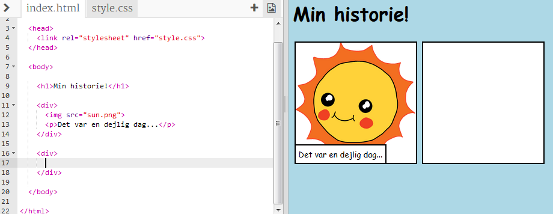
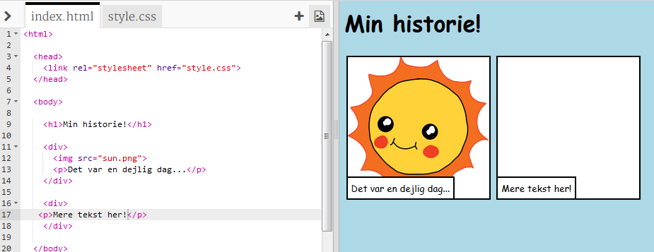

---
title: Fortæl en Historie
level: HTML & CSS 1
language: da-DK
embeds: "*.png"
materials: ["Klubleder Ressourcer/*.*","Projekt Ressourcer/*.*"]
stylesheet: web
...

# Introduktion { .intro}

I dette projekt skal du lære, hvordan du laver din egen webside til at fortælle en historie, en joke eller et digt. 

  

# Trin 1: Beslut dig for en fortælling { .activity}

Før du begynder at kode, så skal du beslutte dig for hvilken slags historie, du gerne vil fortælle.

## Arbejdsliste { .check}

+ Tænk på en historie, som du kunne have lyst til at fortælle. Det kunne fx være: 
	+ En berømt historie;
	+ En historie som du selv finder på;
	+ Noget som er sket for dig, eller en du kender.

Det behøver ikke engang være en historie. Det kunne også være en joke, et digt eller hvad som helst du har lyst til at fortælle om! 

# Trin 2: Redigér din historie { .activity} 

Lad os starte med at redigere HTML indholdet og CSS stylingen af fortællingen på din webside.

## Arbejdsliste { .check}

+ Åbn denne Trinket: <a href="https://trinket.io/html/9adceacf5e" target="_blank">jumpto.cc/web-fortælling</a>. Hvis du læser dette online, så kan du også benytte den indlejrede Trinket nedenfor.

<div class="trinket">
<iframe src="https://trinket.io/embed/html/9adceacf5e" width="100%" height="400" frameborder="0" marginwidth="0" marginheight="0" allowfullscreen></iframe> 
</div> 
 
+ Måske du kan huske, fra 'Tillykke Med Fødselsdagen' projektet, at websiteindhold skal placeres i `<body>` af dit HTML dokument.

Gå til linje 7 i din kode. Her bør du se indholdet på din webside, og at det er placeret mellem vores `<body>` og `</body>` tags.

	

+ Kan du finde ud af, hvilke tags der er brugt til at lave de forskellige dele af websiden? 

	  

+ `<h1>` er en __heading__ (overskrift). Du kan bruge tallene 1 - 6 for at lave overskrifterne forskellig størrelse; 
+ `<div>` er en forkortelse af __division__, og er en måde man kan gruppere ting sammen. Du skal du bruge det på din egen webside, når du skal gruppere dine elementer ud fra hvor de hører til i din historie;  
+ `` er et __image__ (billede); 
+ `<p>` er en __paragraph__ (paragraf) af tekst.  

##Udfordringer: Lav nogle ændringer {.challenge}
Redigér HTML og CSS koden for at gøre din webside helt din egen. 


Du kan forandre farverne, som du bruger på din webside, og du kan også benytte skrifttyper (fonte) såsom <span style="font-family: Arial;">Arial</span>, <span style="font-family: Comic Sans MS;">Comic Sans MS</span>, <span style="font-family: Impact;">Impact</span> og <span style="font-family: Tahoma;">Tahoma</span>.

Hvis du har brug for mere hjælp, så tag et kig på 'Tillykke Med Fødselsdagen' projektet - det kan hjælpe dig.

## Gem dit projekt {.save}

# Trin 3: Fortæl din historie { .activity}

Lad os tilføje en 'del 2' til din historie. 

## Arbejdsliste { .check}

+ Gå til linje 17 i din kode, og tilføj endnu et `<div>` start -og `</div>` slut tag. Så får du en ny boks til næste del af din historie. 

	
  
+ Tilføj en tekstparagraf indeni dit nye `<div>` tag.  

	

+ Endelig kan du tilføje et billede til din nye boks ved at indsætte følgende kode i dit `<div>` tag:  

```   	
	 
```

Læg mærke til at `` tags er en smule anderledes end andre tags, da de ikke har et slut tag. 

+ Med hensyn til HTML billeder skal du tilføje __kilden__ til billedet imellem anførselstegnene. Lad os finde et billede, som vi kan føje til din historie.

Gå til <a href="http://jumpto.cc/web-images" target="_blank">jumpto.cc/web-images</a>, og vælg et billede som du har lyst til at få med i din historie.

+ Højreklik på billedet og klik dernæst 'Kopier billedets webadresse'. Webadressen (URL) er adressen på dit billede.
 
	

+ Indsæt adressen imellem anførselstegnene i dit `` tag. Nu bør du se, at dit billede vises!

	

+ __Hvis du har en Trinket konto__, så kan du også uploade dine egne billeder til din webside. Klik på billedikonet øverst i din trinket, og klik så på 'upload'. 

	  

+ Find dit billede på din computer, og slæb det ind i din trinket.

	

+ Nu kan du så tilføje navnet på dit nye billede imellem anførselstegnene i dit `` tag på denne måde:

``` 
	
``` 

## Gem dit projekt {.save}

##Udfordring: Bliv ved! {.challenge}
Brug hvad du har lært i dette projekt til at færdiggøre din fortælling! Her er et eksempel:

  

## Gem dit projekt {.save}