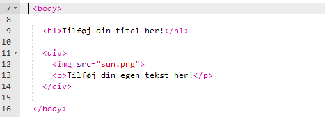
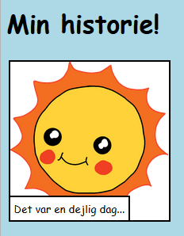
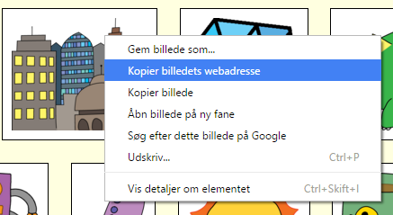

---
title: Fortæl en Historie
level: HTML & CSS 1
language: da-DK
embeds: "*.png"
materials: ["Klubleder Ressourcer/*.*","Projekt Ressourcer/*.*"]
stylesheet: web
...

# Introduktion { .intro}

I dette projekt skal du lære, hvordan du laver din egen webside til at fortælle en historie, en joke eller et digt. 

 SKIFT

# Trin 1: Beslut dig for en fortælling { .activity}

Før du begynder at kode, så skal du beslutte dig for hvilken slags historie, du gerne vil fortælle.

## Arbejdsliste { .check}

+ Tænk på en historie, som du kunne have lyst til at fortælle. Det kunne fx være: 
	+ En berømt historie;
	+ En historie som du selv finder på;
	+ Noget som er sket for dig, eller en du kender.

Det behøver ikke engang være en historie. Det kunne også være en joke, et digt eller hvad som helst, som du kunne have lyst til! 

# Trin 2: Redigér din historie { .activity} 

Lad os starte med at redigere HTML indholdet og CSS stylingen af fortællingen på din webside.

## Arbejdsliste { .check}

+ Åbn denne Trinket: <a href="https://trinket.io/html/8083cfebb3" target="_blank">jumpto.cc/web-fortælling</a>. If you're reading this online, you can also use the embedded version of this trinket below.

<div class="trinket">
<iframe src="https://trinket.io/embed/html/9adceacf5e" width="100%" height="400" frameborder="0" marginwidth="0" marginheight="0" allowfullscreen></iframe> 
</div> 
 
+ Måske du kan huske, fra 'Tillykke Med Fødselsdagen' projektet, at websiteindhold skal placeres i `<body>` af dit HTML dokument.

Gå til linje 7 i din kode. Her bør du se indholdet på din webside, og at det er placeret mellem vores `<body>` og `</body>` tags.

	

+ Kan du finde ud af, hvilke tags der er brugt til at lave de forskellige dele af websiden? 

	 SKIFT

+ `<h1>` er en __heading__ (overskrift). Du kan bruge tallene 1 - 6 for at lave overskrifterne forskellig størrelse; 
+ `<div>` er en forkortelse af __division__, og er en måde man kan gruppere ting sammen. Du skal du bruge det på din egen webside, når du skal gruppere dine elementer ud fra hvor de hører til i din historie;  
+ `` er et __image__ (billede); 
+ `<p>` er en __paragraph__ (paragraf) af tekst.  

##Udfordringer: Lav nogle ændringer {.challenge}
Redigér HTML og CSS koden for at gøre din webside din helt egen. 



Du kan forandre farverne, som du bruger på din webside, og du kan også benytte fonte (skrifttyper) såsom <span style="font-family: Arial;">Arial</span>, <span style="font-family: Comic Sans MS;">Comic Sans MS</span>, <span style="font-family: Impact;">Impact</span> og <span style="font-family: Tahoma;">Tahoma</span>.

Hvis du har brug for mere hjælp, så tag et kig på 'Tillykke Med Fødselsdagen' projektet - det kan hjælpe dig.

## Gem dit projekt {.save}

# Trin 3: Fortæl din historie { .activity}

Lad os tilføje en del to til din historie. 

## Arbejdsliste { .check}

+ Gå til linje 17 i din kode, og tilføj endnu et `<div>` start og `</div>` slut tag. This will create a new box for the next part of your story.

	

https://trinket.io/html/91f654fee9

+ Add a paragraph of text inside your new `<div>` tag.

	

+ Finally, you can add an image to your new box, by adding this code inside your `<div>` tag:

	```
	
	```

	Notice that `` tags are a bit different to other tags, as they don't have an end tag.

+ For HTML images, you need to add the __source__ of the image, inside the speech marks. Let's find an image to add to your story.

	Go to <a href="http://jumpto.cc/web-images" target="_blank">jumpto.cc/web-images</a>, and find an image that you want to include in your story.

+ Right-click the image, and click 'Copy image URL'. The URL is the address of the image.

	

+ Paste the URL between the speech marks in your `` tag. You should see your image appear!

	

+ __If you have a Trinket account__, you can also upload your own images to your webpage! To do this, click the image icon at the top of your trinket and then click 'upload'.

	

+ Find your image on your computer, and drag it into your trinket.

	

+ You can then just add the name of your new image between the speech marks in your `` tag, like this:

	```
	
	```

## Save Your Project {.save}

##Challenge: Keep going! {.challenge}
Use what you've learnt in this project to finish telling your story! Here's an example:


## Save Your Project {.save}

## Community Contributed Translation { .challenge .pdf-hidden }

This project was translated by Kathrine Arens from Centre for Digital Youth Care. Our amazing translation volunteers help us give children around the world the chance to learn to code.  You can help us reach more children by translating a Code Club project via [Github](https://github.com/CodeClub/curriculum_documentation/blob/master/contributing.md) or by getting in touch with us at hello@codeclubworld.