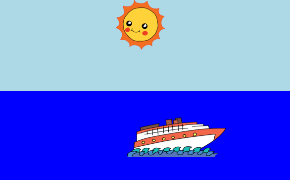

---
title: Sunrise
level: HTML & CSS 1
language: en-GB
embeds: "*.png"
materials: ["Club Leader Resources/*.*","Project Resources/*.*"]
stylesheet: web
...

# Introduction { .intro}

In this project, you'll learn how to use CSS to create an animation of a Sunrise.



# Step 1: Adding the sun { .activity}

Let's start by adding a `div` element for the sun and styling it with some CSS.

## Activity Checklist { .check}

+ Open this trinket: <a href="https://trinket.io/html/cb6495c040" target="_blank">https://trinket.io/html/cb6495c040</a>. If you're reading this online, you can also use the embedded version of this trinket below.

<div class="trinket">
    <iframe src="https://trinket.io/embed/html/cb6495c040" width="100%" height="550" frameborder="0" marginwidth="0" marginheight="0" allowfullscreen>
    </iframe>
</div>

+ If you go to line 27 you'll find the the `div` element for the sky and the sea.

    ```
    <div id="sky"></div>
    <div id="sea"></div>
    ```

+ Let's add another `div` element for the Sun:

    ```
    <div id="sky">
      <div id="sun"></div>
    </div>
    <div id="sea"></div>
    ```

    What happens when you click the Run button?
    How do we make the Sun visible?

+ Styling the Sun:
    Without any CSS styling our Sun is invisible. Let's change that!
    Go to the end of line 22 in your code and press return. Then add the following CSS code:

    ```
    #sun {
        left: 200px;
        top:  0px;
        width: 100px;
        height: 100px;
        background-color: yellow;
        position: relative;
    }
    ```

    Now try clicking the Run button again. Can you see the Sun now?

+ Change the `top` of the Sun to `200px`. What happens to the Sun?
    The Sun is hidden behind the sea `div` element. This will come in useful later as the starting point for our Sunrise animation. To see the Sun again change `top` back to 0px.

##Challenge: Making the Sun round {.challenge}
Our Sun isn't very realistic! Can you think of a CSS property we could use to round off those square edges? Hint: use the Wanted project to help you.

## Save Your Project {.save}

# Step 2: Animating the Sunrise { .activity}

To animate our Sunrise we need to define how the Sun moves and how long it takes to rise. In CSS we can use the `@keyframes` rule to control the movement of the Sun and the `animation-duration` property to set the time to rise.

## Activity Checklist { .check}

+ Let's add the `@keyframes` rule that will control our animation.

    Go to the end of line 23 and press return. Now add the following code:

    ```
    @keyframes sunrise {
        0% {left: 200px; top: 200px;}
    }
    ```

    The line beginning with `0%` defines the start of our animation. In this case we're moving the Sun behind the sea `div` element.

+ We can now define the end of our animation.

    Add this code after the `0%` line but before the curly brackets to set the end position for our animation:

    ```
    100% {left: 200px; top 0px;}
    ```

    This line sets the end position of our animation so that the Sun is at the top of the screen.

+ Trying out the animation:

    Click the Run button.

    Did you see the Sunrise?

    As well as setting the start and end of our animation we also need to tell the sun `div` element to use it. We do this by setting the `animation-name` CSS property for the Sun.

    Go to the end of line 36 and press return. Add the following code:

    ```
    animation-name: sunrise;
    animation-duration: 3s;
    ```

    Click the Run button again. Did you see a Sunrise now?

## Save Your Project {.save}

##Challenge: Make the Sun set {.challenge}
Can you think of a way to change the animation to make the Sun set?
Hint: You'll need to change the `@keyframes` rule so that the the animation starts with the Sun in the sky and finishes with the Sun hidden behind the sea 'div'.

## Save Your Project {.save}
