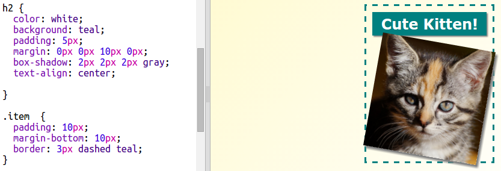
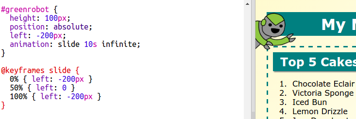

---
title: Magazine
description: Create a multi-page magazine website. 
layout: project
notes: "Magazine - notes.md"
...

# Introduction { .intro}

In this project, you'll learn how to use HTML and CSS to create a multi-page magazine website with a two page layout. You'll also revisit lots of HTML and CSS techiques from other projects. 

  <iframe src="https://trinket.io/embed/html/a41e4e1c5c?outputOnly=true&start=result" width="600" height="500" frameborder="0" marginwidth="0" marginheight="0" allowfullscreen>
  </iframe>
  

# Step 1: Heading and Background

Magazine-style websites often have lots of small items on a page. First you're going to create a heading and background for your magazine. 

## Activity Checklist { .check}

+ Open this trinket: <a href="http://jumpto.cc/web-magazine" target="_blank">jumpto.cc/web-magazine</a>. If you're reading this online, you can also use the embedded version of this trinket below.

  <iframe src="https://trinket.io/embed/html/cef5e64bc0" width="100%" height="400" frameborder="0" marginwidth="0" marginheight="0" allowfullscreen>
  </iframe>

+ Let's add a heading. 

	You can think of a better title for your magazine. 

	

+ Can you style the heading?

	Here's an example, but you can choose your own style:

	

+ Now let's create an interesting background using a gradient and choose a font for the magazine. 

	Here's some example style as a reminder of how to create a gradient: 

	

## Save Your Project {.save}

# Step 2: Creating Columns

Websites often use multiple columns. Let's create a two column layout for your magazine. 

## Activity Checklist { .check}

+ First create two column `div`s.

	Add the highlighted HTML to `index.html`:

	

+ Now style the column divs so that one floats to the left and the other floats to the right. 

	

	Each column is less than 50% so there's room for padding. 

	You'll need to add something to a column to see the effect. 

+ Let's add a kitten picture to the top of column 2. 

	

	Notice that the kitten image is positioned about half-way across the page, in the second column. 

	It's a bit big though!

+ Let's use `max-width: ` to make images fit within their container. 

	Add the following style to `style.css`.

	

	This will apply to all images you use in your magazine, not just the kitten.

+ Now add a class `photo` to the image so that you can style it:

	

+ And style the image to add a shadow and a twist to make the photo pop out of the page:

	

	Make some changes until you like the result. 

# Step 3: Style magazine items

Let's make the layout a bit more interesting. 

## Activity Checklist { .check}

+ Add a `div` around your image with a `class` and add a `h2` heading:

	

+ Now style the item and heading. 

	Here's an example, but you can make changes:

	

## Save Your Project {.save}

##Challenge: Add items to the left column {.challenge}

Can you add a ordered list and a gradient text sticker to the left column? 

Here's an example:

This is the code for the example, but you can change it or come up with your own.

HTML:

CSS:

## Save Your Project {.save}

# Step 4: Add a second page

Let's add another page to your magazine website. 

## Activity Checklist {.check}

+ Add a new page to your project and name it `page2.html`:

+ Page 2 will be quite similar to the first page of your magazine so you can copy the html from `index.html` and paste it into `page2.html`.

Notice that both pages use the same `style.css` so they will share styles. 

+ Change the `<h1>` title for page2: 

+ Now you'll need links between your pages to you can get to page 2 and back to the front page. 

Go back to `index.html`. Add a link inside a div in column 2 in `index.html`:

+ Test that you can click on your new link and move to page 2 of your magazine. 

##Challenge: Add a link back to the first page {.challenge}

Can you add a link to `page2.html` so that you can click on it to get back to the first page?

Hint: Look at the HTML you used to create a link to page 2. 

##Challenge: Fill in your second page {.challenge}

Here's the code for the examples, but you can change the `div`s or come up with your own ideas.  

Click the images icon to see the images that are available to use:

Remember that you can upload your own images to use. Make sure you have permission to use any images that you upload. 

# Step 5: Add an animation

Let's add a fun animation to your magazine. 

## Activity Checklist {.check}

+ Go to `index.html` and include the `greenrobot.png` image at the top of your page. 

+ Now add the CSS to animate your robot:

##Challenge: Add another animation {.challenge}

Can you add an animation to the second page of your magazine? 

