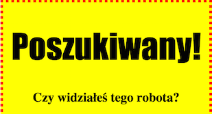

---
title: Wanted!
level: HTML & CSS 1
language: pl-PL
embeds: "*.png"
materials: ["Club Leader Resources/*.*","Project Resources/*.*"]
stylesheet: web
...

# Wstęp {.intro}

W tym projekcie nauczycie się, jak stworzyć własny plakat. 


# Krok 1: Stylizowanie plakatu {.activity}

Zacznijmy od edycji kodu CSS na potrzeby plakatu. 


## Zadania do wykonania {.check}

+ Otwórz edytor: <a href="http://jumpto.cc/web-wanted" target="_blank">jumpto.cc/web-wanted</a>. Jeśli pracujesz online, możesz również posłużyć się wersją wyświetloną poniżej. 

<div class="trinket">
	<iframe src="https://trinket.io/embed/html/58318bee1f" width="100%" height="550" frameborder="0" marginwidth="0" marginheight="0" allowfullscreen>
	</iframe>
</div>

+ Kliknij w zakładkę "style.css". Zauważysz, że znajdują się tam już właściwości CSS dla `div`, które zawierają różne części plakatu. 

	```
	div {
		text-align: center;
	    overflow: hidden;
	    border: 2px solid black;
	    width: 300px;
    }	
	```

+ Zacznijmy od modyfikacji właściwości `text-align`:

	```
	text-align: center;
	```
	
	Co się stanie, gdy zamienisz słowo `center` słowem `left` albo `right`?

+ A co z właściwością `border`?

	```
	border: 2px solid black;
	```

	`2px` w powyższym kodzie oznacza 2 piksele. Co się stanie, jeśli zamienisz frazę `2px solid black` frazą `4px dotted red`?

+ Zmień `width` plakatu na wartość `400px`. Co dzieje się z plakatem?

+ Dodajmy CSS, by ustawić kolor tła plakatu. Przejdź do końca 5. linii kodu i naciśnij return, by otrzymać nową pustą linię.  

	

	Wprowadź poniższy kod do nowej pustej linii:

	```
	background: yellow;
	```

	Upewniej się, by wprowadzić kod w _dokładnie_ takiej formie jak powyżej. Powinieneś zauważyć, że tło `<div>` jest teraz żółte. 
	

## Wyzwanie: Polepszanie plakatu {.challenge}
Dodaj poniższą właściwość CSS do stylu `div`: 

```
border-radius: 40px;
```

Co ta właściwość oznacza? Co się stanie, jeśli zmienisz liczbę w powyższym kodzie? 

## Zapisz swój projekt {.save}

# Krok 2: Stylizowanie obrazów {.activity}

Ulepszmy styl obrazu na plakacie. 

## Zadania do wykonania {.check}

+ W tej chwili nie ma żadnych właściwości w tagu ``, więć dodajmy jakieś! 

	Po pierwsze, dodaj następujący kod pod CSSem twojego div:

	```
	img {

	}
	```

	

+ Możemy teraz dodawać właściwości CSS dla obrazów pomiędzy nawiasami klamrowymi - tym: `{` a tym: `}`.

	W ramach przykładu dodaj następujący kod pomiędzy nawiasami klamrowymi, by ustawić szerokość obrazu:
	```
	width: 100px;
	```

	Zobaczysz, że rozmiar obrazu zmienia się, a jego szerokość wynosi 100 pikseli. 

	

+ Możesz ponadto dodać obwódkę dookoła obrazu za pomocą tego kodu: 

	```
	border: 1px solid black;
	```

+ Czy zauważyłeś, że pomiędzy obrazem a obwódką nie ma zbyt wiele miejsca? 

	

	Możesz to naprawić poprzez dodanie wypełnienia wokół obrazu: 

	```
	padding: 10px;
	```

	Wypełnienie to przestrzeń pomiędzy zawartością (w tym wypadku - obrazem) a jej obwódką. 

	

	Jak myślisz - co zaszłoby, gdybyś zmienił wartość wypełnienia na `50px`?

## Wyzwanie: Polepszanie obrazu {.challenge}
Czy potrafisz wzbogacić swój obraz o kolor tła? Albo o zaokrągloną obwódkę? 

## Zapisz swój projekt {.save}

# Krok 3: Stylizowanie nagłówków { .activity .new-page }

Ulepszmy styl nagłówka `<h1>`.

## Zadania do wykonania {.check}

+ Dodaj poniższy kod pod CSSem obrazu: 

	```
	h1 {

	}
	```

	To właśnie tu dodasz właściwości CSS dla twojego głównego nagłówka `<h1>`.

+ Aby zmienić czcionkę twojego nagłówka `<h1>`, dodaj następujący kod pomiędzy nawiasami klamrowymi: 
	```
	font-family: Impact;
	```

+ Możesz również zmienić rozmiar nagłówka: 

	```
	font-size: 50pt;
	```

+ 	Czy zauwazyłeś, że pomiędzy nagłówkiem `<h1>` i jego otoczeniem znajduje się duża przestrzeń? 

	

	To dlatego, że dookoła nagłówka znajduje się margines. Margines to przestrzeń pomiędzy elementem (w tym wypadku - nagłówkiem) a jego otoczeniem. 

	Można zmniejszyć margines za pomocą tego kodu: 

	```
	margin: 10px;
	```

	

+ Można ponadto podkreślić nagłówek: 

	```
	text-decoration: underline;
	```

## Wyzwanie: Spraw, aby plakat rządził! {.challenge}
Dodaj więcej kodu CSS, by wystylizować swój nagłówek `<h3>` oraz akapity. 


Oto lista właściwości CSS, którymi możesz się posłużyć:

```
color: black;
background: white;
font-family: Arial / Comic Sans MS / Courier / Impact / Tahoma;
font-size: 12pt;
font-weight: bold;
text-decoration: underline overline line-through;
margin: 10px;
padding: 10px;
width: 100px;
height: 100px;
```

## Zapisz swój projekt {.save}

## Wyzwanie: Zareklamuj wydarzenie! {.challenge}
Czy potrafisz stworzyć plakat reklamujący imprezę w twojej szkole? Może to być przedstawienie teatralne, wydarzenie sportowe, a nawet reklama dla spotkania Code Clubu! 

## Zapisz swój projekt {.save}