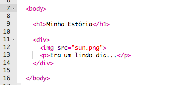
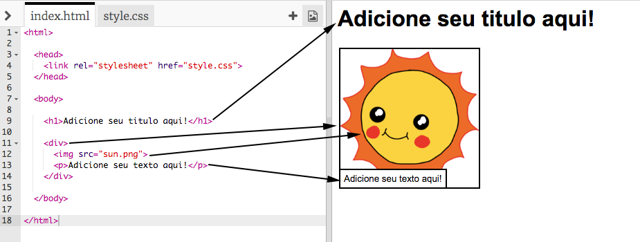
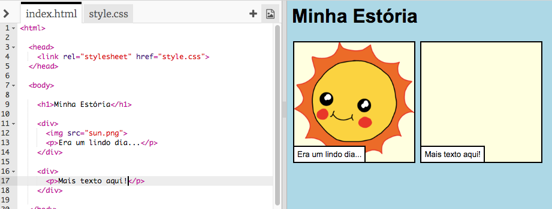
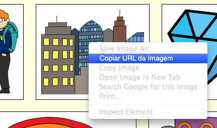
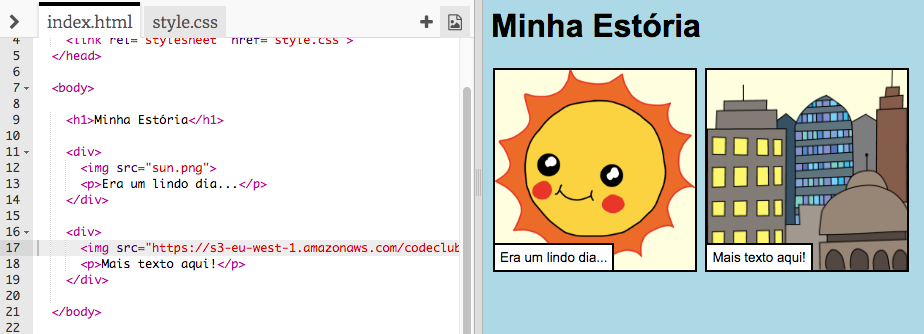
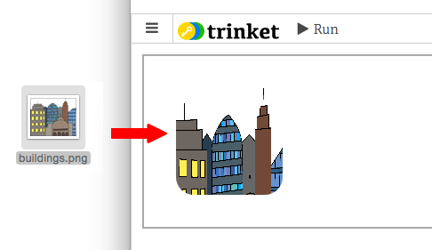

---
title: Conte uma história
level: HTML & CSS 1
language: pt-BR
embeds: "*.png"
materials: ["Club Leader Resources/*.*","Project Resources/*.*"]
stylesheet: web
...

# Introdução { .intro}

Neste projeto, você vai aprender como criar a sua própria página na web para contar uma história, anedota, piada ou poema. 


# Passo 1: Escolhendo o que contar { .activity}

Antes de começarmos com o código, você precisa decidir o que contará em sua página.

## Lista de Atividades { .check}

+ Pense sobre a história que você quer contar. Pode ser:
	+ Uma história famosa;
	+ Uma história inventada por você;
	+ Algo que tenha acontecido com você ou alguém que você conheça.

	Não precisa ser uma história também. Pode ser uma piada, poema ou qualquer coisa que você queira! 

# Passo 2: Editando a sua história { .activity}

Vamos começar editando o conteúdo em HTML e a folha de estilos CSS da página da nossa história.

## Lista de Atividades { .check}

+ Abra este trinket: <a href="http://bit.ly/conte-uma-historia" target="_blank">bit.ly/conte-uma-historia</a>. Se você estiver utilizando essa lição online, você também pode usar a versão embutida deste Trinket abaixo. 

<div class="trinket">
	<iframe src="https://trinket.io/embed/html/1ddbf3802e" width="100%" height="400" frameborder="0" marginwidth="0" marginheight="0" allowfullscreen>
	</iframe>
</div>

+ Você deve lembrar do projeto "Feliz aniversário" que o conteúdo da nossa página fica no `<body>`, no corpo do nosso documento HTML. 

	Vá até a linha 7 do código, você deve encontrar o conteúdo da página, que fica entre as marcações (tags) `<body>` e `</body>`.

	

+ Você consegue identificar quais são as tags usadas para criar as diferentes partes de uma página na internet?

	

	+ `<h1>` é o __heading__ (cabeçalho). Você pode usar dos números 1 ao 6 para criar cabeçalhos de diferentes tamanhos; 
	+ `<div>` é a abreviação de __division__ (divisão), e é uma maneira de agrupar coisas junto. Nessa página, você vai utilizá-la para agrupar todas as coisas para cada parte da sua história;
	+ `` é uma __image__ (imagem);
	+ `<p>` é um __paragraph__, ou seja, um parágrafo de texto.

##Desafio: Faça algumas alterações {.challenge}
Edite o código HTML e o CSS para deixar a sua página da maneira que você gosta.


Você pode alterar as cores usadas nessa página, e você também pode encontrar vocês como <span style="font-family: Arial;">Arial</span>, <span style="font-family: Comic Sans MS;">Comic Sans MS</span>, <span style="font-family: Impact;">Impact</span> e <span style="font-family: Tahoma;">Tahoma</span>.

Se você precisar de mais ajuda, você pode consultar o projeto "Feliz aniversário" para relembrar o que já aprendeu! 

## Salve seu projeto {.save}

# Passo 3: Contando a sua história { .activity}

Vamos adicionar uma segunda parte à sua história. 

## Lista de Atividades { .check}

+ Vá até a linha 17 do código, e adicione e adicione outro conjunto de `<div>` e `</div>`, ou seja, começo e fim da tag (marcação). Isso criará uma nova caixa para a próxima parte da sua história. 

	

+ Adicione um parágrafo dentro da sua nova tag `<div>`.

	

+ Finalmente, você pode adicionar uma imagem ao seu novo bloco, ao adicionar este código dentro da sua tag `<div>`:

	```
	
	```

	Repare que a tag `` é um pouco diferente das outras tags, pois ela não possui uma tag de fechamento! 

+ Para as images no HTML, você precisa adicionar a __source__ (origem, fonte) da sua imagem entre as aspas. Vamos encontrar uma imagem para adicionar à sua história.

	Vá para <a href="http://jumpto.cc/web-images" target="_blank">jumpto.cc/web-images</a>, e encontre uma imagem que você queira incluir na sua história. 

+ Dê um clique com o botão direito sobre a imagem, então clique em "Copiar URL da imagem". Caso não encontre essa opção, peça ajuda ao(à) instrutor(a). O URL é o endereço da imagem, ou seja, a sua origem, fonte e etc.

	

+ Cole o URL entre as aspas da sua tag ``. A imagem deve aparecer na sua página!

	

+ __Se você tiver uma conta no Trinket__, você também pode carregar (upload) suas próprias imagens para usar na sua página. Para fazer isso, clique no ícone de imagem que fica na parte de cima, no lado direito, então, clique em 'upload'.

	

+ Encontre a imagem que deseja em seu computador, arraste ela até o seu Trinket.

	

+ Você pode então adicionar apenas o nome da sua imagem entre as aspas da sua tag ``, desta forma:

	```
	
	```

## Salve seu projeto {.save}

##Desafio: Continuando! {.challenge}
Use o que você acabou de aprender neste projeto para finalizar a sua história, aqui vai um exemplo: 


## Salve seu projeto {.save}