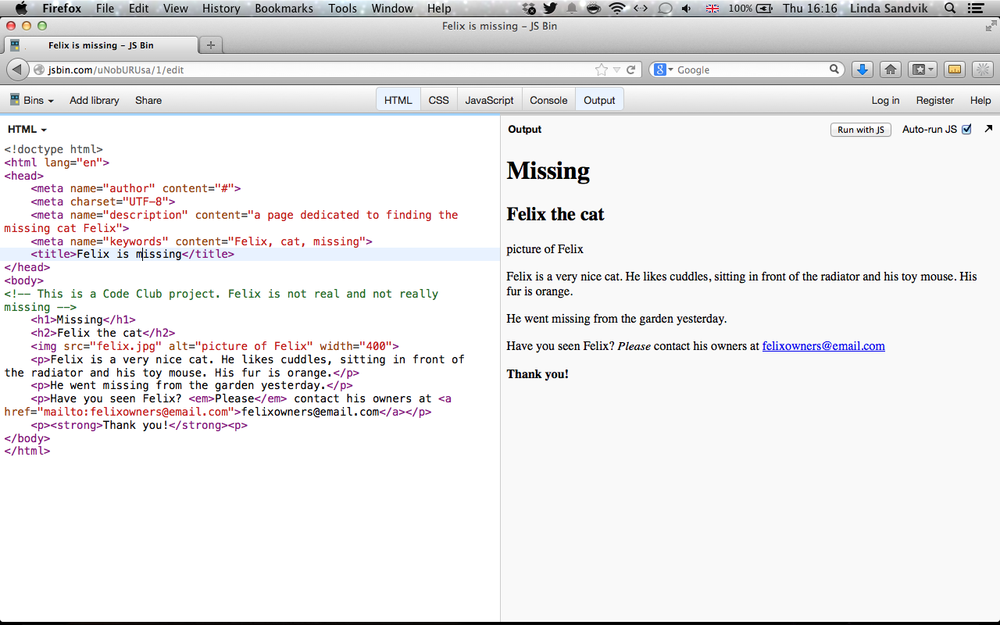

## __Uppdraget__ { .intro}

Katten Felix har försvunnit. Hans ägare har gjort en plansch för att sätta upp i området, men du inser att många fler personer skulle se planschen på internet.


#Steg 1 { .activity}

+ Gör en ny mapp som heter Felix
+ Gör ett nytt dokument som heter 'index.html' och spara det i mappen **Felix**
+ Starta upp ditt dokument så som du lärt dig under tidigare lektioner

```html
<!DOCTYPE html>
<html>
	<head>
	</head>
	<body>
	</body>
</html>
```

+ Gör en titel och en rubrik. Kom ihåg att titeln ska skrivas i head-taggen och rubriken ska skrivas i body-taggen. Använd "En bortsprungen katt" som titel, och bortsprungen som h1. Precis under `<h1>` kan vi göra en `<h2>` där det står “Katten Felix”.

```html
<!DOCTYPE html>
<html>
	<head>
		<title>En bortsprungen katt</title>
	</head>
	<body>
		<h1>Bortsprungen</h1>
		<h2>Katten Felix</h2>
	</body>
</html>
```

#Steg 2 { .activity}

Vi behöver också en bild på Felix så att folk vet vad de ska leta efter. Vi har tidigare lärt oss hur man lägger in en bild som redan finns någonstans på Internet, men den här gången ska vi använda en bild som ligger på vår dator. Vi måste lägga bilden **felix.jpg** i samma mapp som `index.html`, den mapp som du döpte till **Felix**.

+ Skriv nu taggen `` som du normalt gör, men istället för att skriva bildens URL i src-attributet så skriver vi bara `felix.jpg`. Glöm inte att skriva in ett alt-attribut!

```html

```

## Spara din fil och granska den i en webbläsare. { .save}

+ Bilden är ganska stor så vi vill göra den lite mindre. Det kan vi göra genom att använda attributen höjd (height) och bredd (width). Vi specificerar inte bredden i centimeter, meter, tum eller fot utan i något som kallas för *pixlar*. Jag ska köra på 400 pixlar för den här bilden.

```html

```

#Steg 3 { .activity}

Under bilden ska vi skriva in en beskrivning av Felix och uppge ett par detaljer om var och när han försvann. För att göra detta räcker det att skriva några meningar.

```html
<p>Felix är en väldigt snäll katt. Han gillar att kela, sitta framför tv:n och sin leksaksmus. Han har orange päls. </p>
<p>Han försvann från trädgården under gårdagen.</p>
```

Vi behöver också information om hur man kan kontakta ägaren om någon har sett eller hittar Felix. 

```html
<p>Har du sett Felix? Snälla kontakta hans ägare på felixägare@email.com</p>
```

Det här är bara en låtsasemailadress men låt oss göra så att om någon klickar på den så öppnas deras mailklient. Vi gör det här på nästan samma sätt som vi gör en länk men istället för ett __url__ läger vi in ett `mailto` så här:

```html
<p>Har du sett Felix? Snälla kontakta hans ägare på <a href="mailto:felixägare@email.com">felixägare@email.com</a></p>
```

## Spara din fil och granska den i en webbläsare! { .save}

# Steg 4: Lägg till fet- och kursiv stil { .activity}

Vi vill verkligen att någon ska hitta Felix, därför vill vi lägga till *betoning* på ‘snälla’. Vi gör det med hjälp av en em-tag.

```html
<p>Har du sett Felix? <em>Snälla</em> kontakta hans ägare på felixägare@email.com</p>
```

Vi vill också att ‘tack’ ska stå ut, det kan vi göra genom att lägga till fet stil. 

```html
<p><strong>Tack!</strong><p>
```

## Spara din fil och granska den i en webbläsare. { .save}

Har du lagt märke till hur 'snälla' nu är i *kursiv stil* och tack är **fet stil**?

#Steg 5: Kommentarer { .activity}

Ibland är det användbart att skriva kommentarer i själv html-filen. När vi säger kommentarer så menar vi saker som kan vara användbart för andra människor som läser filen, och inget som webbläsaren ska kunna förstå och visa. Vi gör det genom att använda en speciell kod:

```html
<!-- Skriv vad som helst här -->
```

Allt som står mellan pilarna är kommentaren. Låt oss lägga in kommentaren i vår fil och säga att det här är ett Code Club-projekt och att Felix inte finns på riktigt.

```html
<!-- Det här är ett Code Club-projekt. Felix finns egentligen inte på riktigt och är inte bortsprungen -->
```

# Steg 6: Mer metadata (det är saker som du kan skriva i sidhuvudet) { .activity}

+ Nu lägger vi till vem det var som skrev webbsidan, så att alla som tittar på filen vet att det är du som gjort den.

```html
<meta name="author" content="#">
```

+ Byt ut # mot ditt namn. Det är också vanligt att man skriver till vilket språk som webbsidan är på. Vi gör det genom att lägga till ett attribut till `<html>`-taggen.

```html
<html lang="sv">
```

*sv* står för svenska. 

Det är också en bra övning att lägga till teckenuppsättningen (eller alfabetet) som du har använt för att skriva dokumentet. Vi använder oftast __UTF-8__.

```html
<meta charset="UTF-8">
```

Vi kan också lägga till en beskrivning av webbsidan.

```html
	<meta name="beskrivning" content="en sida till för att hitta den bortsprungna katten Felix">
```

Och ett par nyckelord, separerade med ett komma

```html
<meta name="nyckelord" content="Felix, katt, bortsprungen">
```



##Pröva också: { .try}

+ Är det något mer som du kan lägga till på webbsidan för att hjälpa människor att lättare hitta Felix? Mer information? Hur skulle du lägga till en karta över varifrån han sprang bort?
+ Mer kul med bilder. Lägg till en bild som rör sig. Försök att lägga till bilden `catswithhats.gif` till webbsidan. Öppna den i webbläsaren för att se vad som händer.
+ När Felix hittats och återvänt hem, använd taggen `<del>` för att stryka över den information som inte längre stämmer, till exempel att han är bortsprungen. Använd `<ins>` taggen för att lägga till ny information istället, till exempel __Hittad__!
