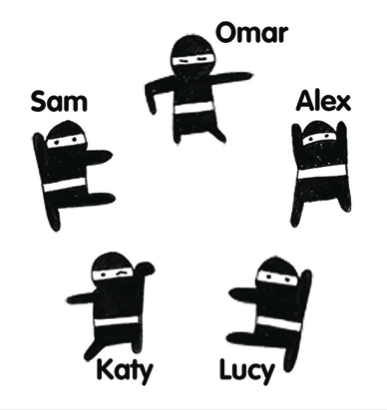

## Uppgiften { .intro}

Det här projektet kommer att bygga på din kunskap om CCS-kung fu.

Fem ninjor har kommit till staden och behöver gömma sig innan någon ser dem. Använd din egna ninjaliknande CSS-kunskaper för att få dem till ett säkert ställe. Du kan flytta på ninjorna, och några av objekten på gatan också. Fort! Det är ont om tid!

# Steg 1: Träffa ninjorna { .activity}

+ Öppna filen som heter `ninjas.html` i textredigeraren. Öppna den i webbläsaren också.
+ Läs igenom koden. Kan du gissa vilka delar som hör till vilka objekt på gatan? Notera att vi använder två språk: HTML för att lägga till alla element till sidan, och CSS placerad mellan `style`-taggarna. 
+ Elementen som vi kommer att använda är bilderna (``-taggarna). Vi kan kontrollera deras position genom att använda CSS.

**Låt oss flytta på en ninja**

+ Varje ninja har namngetts genom att använda `id`-attributet. Låt oss flytta ninjan Alex först. Hitta CSS-regeln som hör till Alex. 
+ Ändra värdet av `left`(vänster) till `100px` och `top`(övre) till `320px`. När `position`-egenskapen är satt till `absolute` betyder det att vi kommer att beskriva positionen i relation till ninjans förälderelement (parent element) - i det här fallet `
´ med `id` `street_corner`. `px`betyder `pixel`. `left` beskriver hur långt ninjan ska flyttas från vänster sida (hur många pixlar), och `top` säger till webläsaren hur långt den ska flyttas ner från den övre kanten. 
+ Ändra `left`(vänster) till `right`(höger) och `top`(övre) till `bottom`(nedre). Nu säger koden till webbläsaren att sätta ninjan `100px` till vänster om den högra kanten, och `320px` upp från den nedre kanten. 

Pixlar beskriver den minsta fysiska punkt som skärmen kan visa. De används ofta för att beskriva skärmupplösning.

# Steg 2: Låt oss prova att beskriva det lite annorlunda { .activity}

Nu vet du hur man använder pixelpositionering. Detta är inte det enda sättet vi kan beskriva positionerna på skärmen, så låt oss titta på några andra alternativ som vi har. 

+ Hitta `wheelie_bin`-elementet i CSS:en

100% beskriver hela bredden av tillgänligt skärmutrymme. Eftersom vi positionerar ninjor och andra objekt i relation till `street_corner` (gathörn), som är 600 pixlar bred, i vårt fall kommer 100% att vara samma som `600px`. Om vi skulle rita ett större gathörn, till exempel `800px`bred, då skulle 100% betyda `800px`. Beroende på sammanhanget, har storlekar som beskrivs med procent olika betydelse. 

# Steg 3:  Ännu en enhetstyp { .activity}

Som om vi inte redan hade tillräckligt med enhetstyper, kommer vi nu att prova ännu en! Du vet hur man använder pixlar och procent, så låt oss nu prova `ems`.

`Em`är en mätningstyp som lånats från typografin, som handlar om utseendet på bokstäver och text. En em är lika med det nuvarande typsnittet. Notera att i början av CSS:en sätter vi `font-size` på `body`-elementet till 20px, så en `em` kommer att vara 20 pixlar. 

+ Hitta `bicycle` (cykeln) i CSS:en. Förutom `em´-biten så borde det se bekant ut. Se om du kan flytta cykeln för att gömma Ninjan Sam. 
+ Vi har nämnt att storleken på `em`:en är baserad på typsnittsstorleken (font size). För att se det i praktiken, hitta `body` i CSS:en. Ändra `font-size`-värdet (typsnittvärdet) till 30px. Vad hände? Eftersom varje `em` är 30 pixlar bred och 30 pixlar hög kommer alla element som använder detta mätvärde att ha ändrat sin position!

# Steg 4: Fort, göm ninjorna!  { .activity}

Nu när du vet hur man flyttar element på skärmen så är det dags att hjälpa ninjorna. Använd olika sätt att beskriva deras position. Kom ihåg, du kan även flytta på några av objekten. Vilken enhetstyp känner du dig mest bekväm med att använda? Hitta det bästa sättet att ordna bästa gömstället. Lycka till!

## Saker att prova { .try}

+ Kan du komma på hur man gör så att ninjorna syns framför några av gatuobjekten? Vad skulle hända om du kopierade ``-taggen för ninjan efter `´-taggen som visar objektet?
+ Kan du lägga till några fler objekt till scenen? Du kan lägga till bilder från din dator eller bilder som du hittar på internet.

